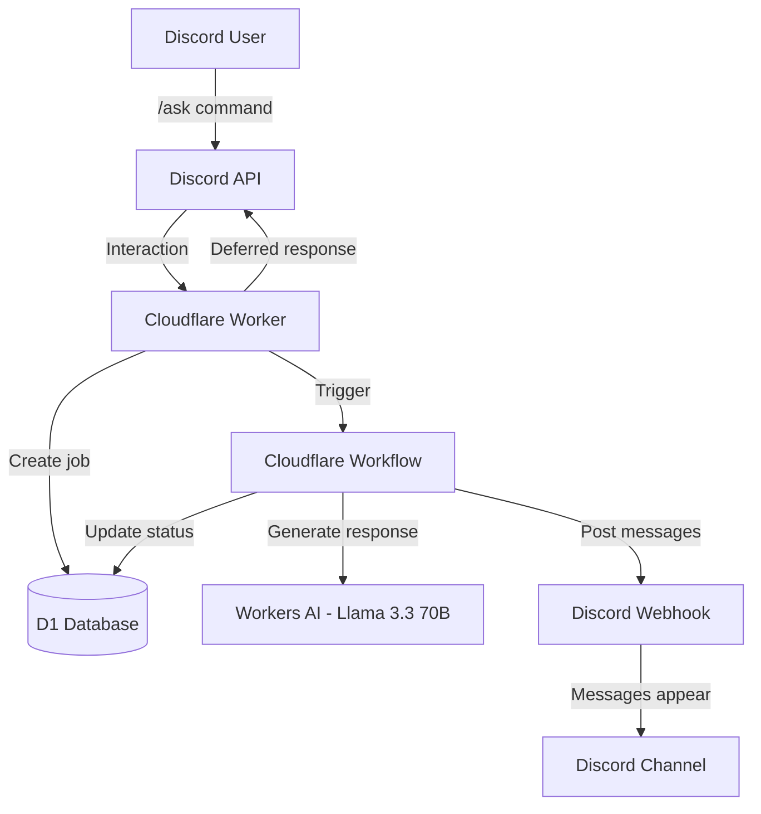
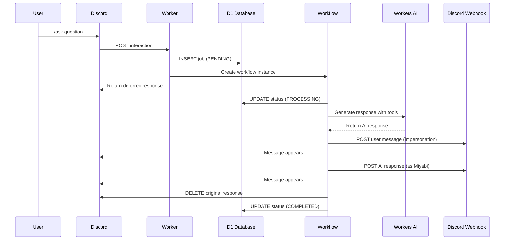
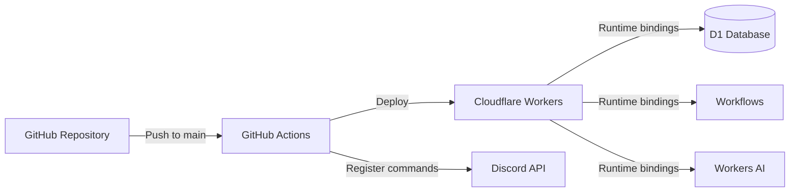

# Miyabi Infrastructure

This document describes the system architecture and infrastructure components of Miyabi.

## Architecture Overview

Miyabi runs on Cloudflare's edge platform, utilizing Workers, D1 database, Workflows, and Workers AI.



## Request Flow



## Components

### Cloudflare Worker

Entry point for Discord interactions. Handles:
- Discord interaction verification
- User information extraction (name, avatar)
- Job creation in D1
- Workflow triggering
- Deferred response management

**File**: `src/index.ts`

### Cloudflare Workflow

Durable execution environment for async processing. Steps:
1. Update job status to PROCESSING
2. Generate AI response (max 5 tool call rounds)
3. Post user message via webhook
4. Post AI response via webhook
5. Delete deferred interaction
6. Update job status to COMPLETED

**File**: `src/workflow.ts`

### D1 Database

SQLite database for job tracking. Schema:

```sql
CREATE TABLE jobs (
  id TEXT PRIMARY KEY,
  token TEXT NOT NULL,
  status TEXT NOT NULL,  -- PENDING, PROCESSING, COMPLETED, ERROR
  result TEXT,
  created_at INTEGER DEFAULT (unixepoch())
)
```

**File**: `schema.sql`

### Workers AI

AI inference using Llama 3.3 70B Instruct (FP8 Fast). Features:
- Tool calling support
- Multi-round conversations
- System prompt with personality definition

**Model**: `@cf/meta/llama-3.3-70b-instruct-fp8-fast`

### Discord Webhook

Used for posting messages to Discord channels. Supports:
- User impersonation (custom username and avatar)
- Bot messages (as Miyabi)
- Message formatting and escaping

## Infrastructure Requirements

### Cloudflare Account

Required services:
- Workers (edge compute)
- D1 (serverless SQLite)
- Workflows (durable execution)
- Workers AI (LLM inference)

### Discord Application

Required configuration:
- Bot application with slash command support
- Webhook URL for message posting
- Application ID and public key for verification
- Bot token for command registration

## Environment Variables

### Worker Bindings (wrangler.jsonc)

- `AI`: Workers AI binding
- `miyabi_db`: D1 database binding
- `miyabi_workflow`: Workflow binding

### Secrets

- `DISCORD_APPLICATION_ID`: Discord app ID
- `DISCORD_PUBLIC_KEY`: Public key for interaction verification
- `DISCORD_WEBHOOK_URL`: Webhook URL for posting
- `DISCORD_TOKEN`: Bot token for command registration

## Deployment Architecture



## Scalability

- **Workers**: Auto-scales globally across Cloudflare's network
- **D1**: Serverless SQLite with automatic replication
- **Workflows**: Durable execution with automatic state management
- **Workers AI**: Managed inference with automatic scaling

## Cost Optimization

- Workers: Pay-per-request model
- D1: Free tier includes 5GB storage, 5M reads/day
- Workflows: Free tier includes 10M step transitions/month
- Workers AI: Usage-based pricing per token

## Monitoring

Observability enabled in `wrangler.jsonc`:
- Real-time logs via Wrangler tail
- Cloudflare dashboard analytics
- Error tracking and debugging
